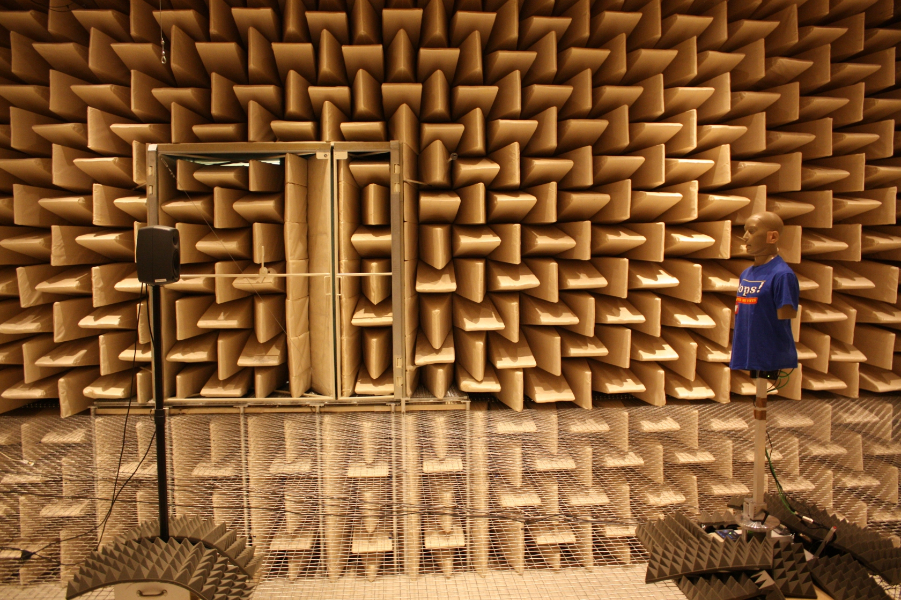

Anechoic HRIRs from the KEMAR manikin with different distances
==============================================================

Head-related transfer functions (HRTFs) measured with a KEMAR in the anechoic
chamber of the TU Berlin [1].  The HRTFs were measured in the horizontal plane
with a resolution of 1° for the three different distances of 0.5m, 1m, 2m, 3m.

## Setup



The impulse response measurements were carried out in the anechoic chamber of
the Institut für Technische Akustik at Technische Universität Berlin.  The lower
frequency limit of the anechoic chamber is 63 Hz. An active two-way loudspeaker
(Genelec 8030A) was used as a sound source. The excitation signal was a linear
sine sweep with a length of 5.3s. It had a 6dB per octave low-shelf emphasis
below 1000Hz causing an amplification of 20dB for low frequencies.

The responses were measured using a Knowles Electronics Manikin for Acoustic
Research (KEMAR, type 45BA) with the corresponding large ears (type KB0065 and
KB0066). The manikin was mounted on the turntable of the VariSphear measurement
system [2] to be able to rotate it automatically with high mechanical precision.
All measurements were performed for a full rotation (360◦) in 1◦ increments. The
distance between the center of the manikin and the center of the loudspeaker was
set to 3m, 2m, 1m and 0.5m, respectively. The loudspeaker was positioned at ear
height of the manikin.

Ear signals were recorded with G.R.A.S. 40AO pressure microphones using a RME
QuadMic pre-amplifier and a RME Multiface II audio interface. Playback,
recording and control of the measurements was done with the VariSphear software
[2]. All data was recorded with a sampling rate of 44.1kHz and stored as single
precision floating point values.

Note, that for the distance of 0.5m the used Genelec loudspeaker presents not
really a point source. In addition, the HRTFs for 0.5m include reflections of
the sound going from the KEMAR head back to the loudspeaker and back to the
dummy head.

## File formats

The naming scheme of the impulse response files is:
```
QU_KEMAR_anechoic[_<distance>].sofa
QU_KEMAR_<headphone>_hcomp.wav
```
where the file without distance naming contains the measurements for all radii
in a single file.

The [SOFA file
format](http://www.sofaconventions.org/mediawiki/index.php/Main_Page) is a
spatial audio file format which should allow easy sharing and distribution of
impulse response measurements.

## Headphone compensation filters

Headphone compensation filters were calculated for three different headphone
models. The procedure followed the work presented in [3]. In a first step, one
complex transfer function per headphone model was derived by averaging the
repeated measurements for the left and right channel. A frequency domain
least-squares error inversion technique with frequency-dependent regularization
was used to calculate the headphone compensation filters. The chosen
regularization allows to equalize only those parts of the frequency response
which did not vary too much for the repeated measurements. The length of the
resulting filters is 4096 coefficients.

## References

[1] H. Wierstorf, M. Geier, A. Raake, S. Spors - A Free Database of Head-Related
Impulse Response Measurements in the Horizontal Plane with Multiple Distances.
In 130th AES Conv. 2011, eBrief 6.

[2] B. Bernschütz, C. Pörschmann, S. Spors, S. Weinzierl - Entwurf und Aufbau eines variablen sphärischen Mikrofonarrays für Forschungsanwendungen
in Raumakustik und virtual Audio. In DAGA. 2010.

[3] Z. Schärer, A. Lindau. Evaluation of equalization methods for binaural signals. In 126th AES Conv. 2009.
